# Multi-Cloud Operations Dashboard - Class Diagrams

## Backend Class Structure

### Core Authentication Classes

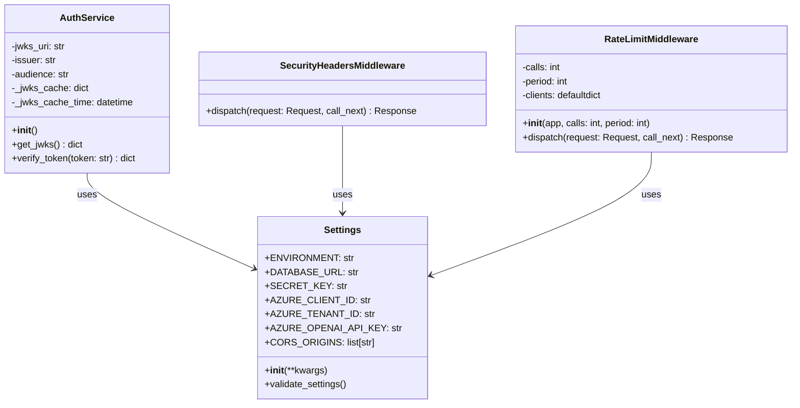

### Data Models

```mermaid
classDiagram
    class BaseModel {
        <<abstract>>
        +id: int
        +created_at: datetime
        +updated_at: datetime
    }
    
    class Project {
        +id: int
        +project_name: str
        +project_type: str
        +member_firm: str
        +deployed_region: str
        +is_active: bool
        +description: str
        +engagement_manager: str
        +project_startdate: date
        +project_enddate: date
        +status: ProjectStatus
        +progress_percentage: int
        +budget_allocated: int
        +budget_spent: int
        +priority: ProjectPriority
        +health_status: ProjectHealthStatus
        +resource_groups: list[ResourceGroup]
        +monthly_costs: list[MonthlyCost]
        +aiq_consumptions: list[AIQConsumption]
    }
    
    class ResourceGroup {
        +id: int
        +resource_group_name: str
        +project_id: int
        +status: str
        +project: Project
        +cost_data: list[CostData]
        +monthly_costs: list[MonthlyCost]
    }
    
    class CostData {
        +key: str
        +period: date
        +month_year: str
        +resource_group_id: int
        +cost: decimal
        +resource_group: ResourceGroup
    }
    
    class MonthlyCost {
        +project_id: int
        +resource_group_id: int
        +month: date
        +cost: decimal
        +project: Project
        +resource_group: ResourceGroup
    }
    
    class AIQConsumption {
        +id: int
        +project_id: int
        +aiq_assumption_name: str
        +consumption_amount: decimal
        +consumption_day: date
        +project: Project
    }
    
    class CloudConnection {
        +id: int
        +provider: str
        +connection_name: str
        +credentials: dict
        +is_active: bool
        +created_at: datetime
        +updated_at: datetime
    }
    
    BaseModel <|-- Project
    BaseModel <|-- ResourceGroup
    BaseModel <|-- AIQConsumption
    BaseModel <|-- CloudConnection
    
    Project ||--o{ ResourceGroup : "has many"
    Project ||--o{ MonthlyCost : "has many"
    Project ||--o{ AIQConsumption : "has many"
    ResourceGroup ||--o{ CostData : "has many"
    ResourceGroup ||--o{ MonthlyCost : "has many"
```

### Pydantic Schemas

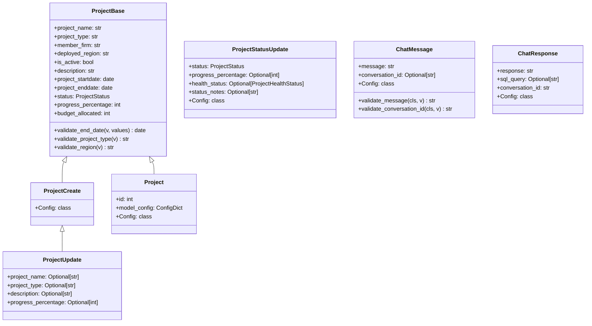

### Service Classes

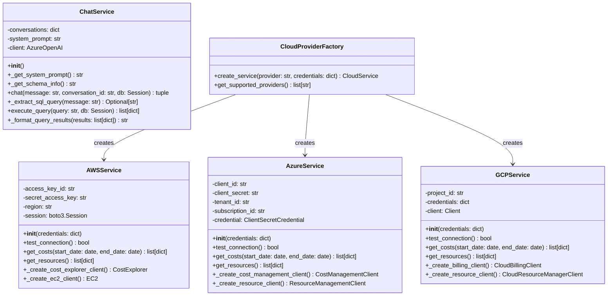

### API Router Classes

```mermaid
classDiagram
    class ProjectsRouter {
        +router: APIRouter
        +get_projects(skip: int, limit: int, status: str, region: str, db: Session, current_user: dict) list[Project]
        +get_project(project_id: int, db: Session, current_user: dict) Project
        +create_project(project: ProjectCreate, db: Session, current_user: dict) Project
        +update_project(project_id: int, project: ProjectUpdate, db: Session, current_user: dict) Project
        +update_project_status(project_id: int, status_update: ProjectStatusUpdate, db: Session, current_user: dict) Project
        +delete_project(project_id: int, db: Session, current_user: dict) dict
    }
    
    class ChatRouter {
        +router: APIRouter
        +chat_endpoint(chat_message: ChatMessage, db: Session, current_user: dict) ChatResponse
    }
    
    class CostsRouter {
        +router: APIRouter
        +get_costs(project_id: Optional[int], resource_group_id: Optional[int], db: Session, current_user: dict) list[dict]
        +create_cost(cost_data: dict, db: Session, current_user: dict) dict
    }
    
    class CloudProvidersRouter {
        +router: APIRouter
        +get_cloud_providers(db: Session, current_user: dict) list[CloudConnection]
        +create_cloud_provider(connection_data: dict, db: Session, current_user: dict) CloudConnection
        +test_connection(test_data: dict, current_user: dict) dict
        +get_provider_costs(provider_id: int, request_data: dict, db: Session, current_user: dict) list[dict]
    }
    
    class DashboardRouter {
        +router: APIRouter
        +get_dashboard_summary(db: Session, current_user: dict) dict
        +get_project_metrics(db: Session, current_user: dict) dict
        +get_cost_metrics(db: Session, current_user: dict) dict
    }
    
    ProjectsRouter --> Project : uses
    ProjectsRouter --> ProjectCreate : uses
    ProjectsRouter --> ProjectUpdate : uses
    ChatRouter --> ChatMessage : uses
    ChatRouter --> ChatResponse : uses
    ChatRouter --> ChatService : uses
    CloudProvidersRouter --> CloudConnection : uses
    CloudProvidersRouter --> AWSService : uses
    CloudProvidersRouter --> AzureService : uses
```

## Frontend Class Structure

### React Component Hierarchy

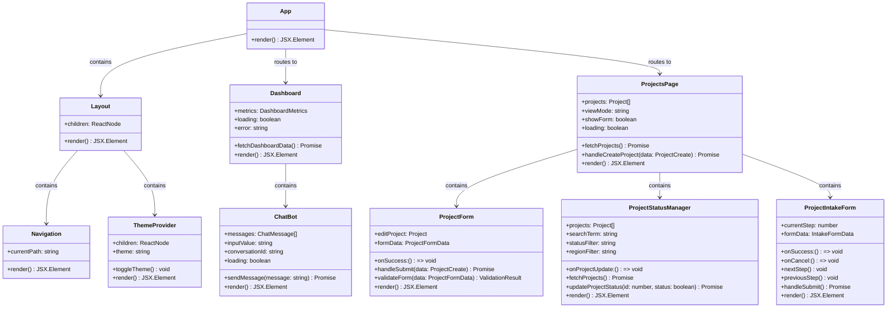

### Custom Hooks

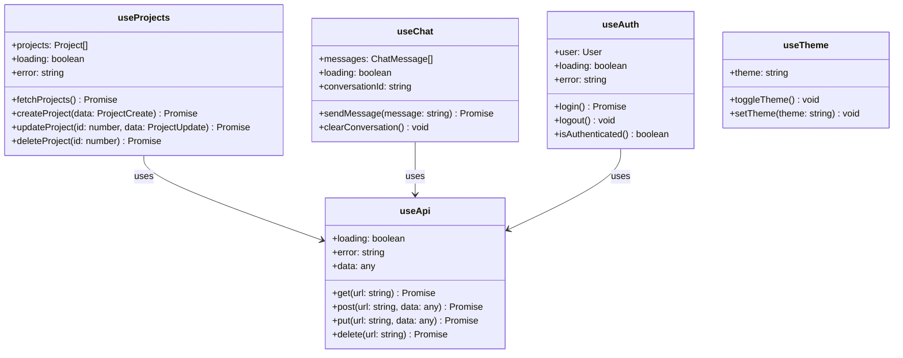

### Context Providers

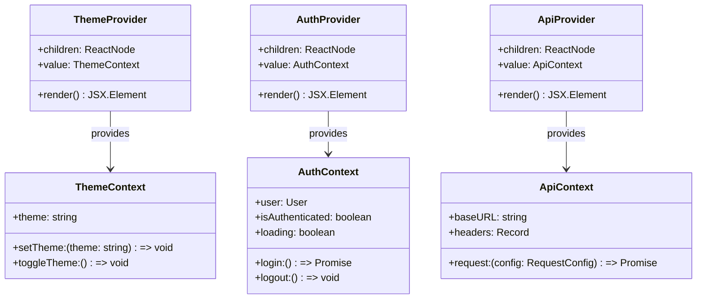

## Testing Class Structure

### Backend Test Classes

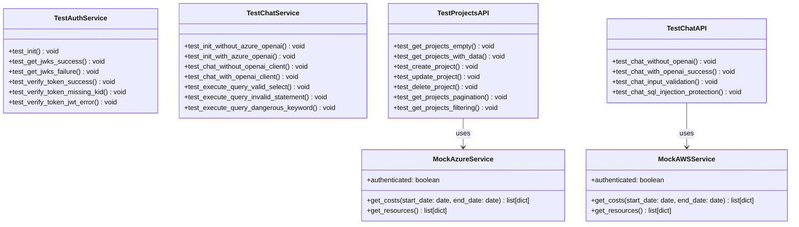

### Frontend Test Classes (Playwright)

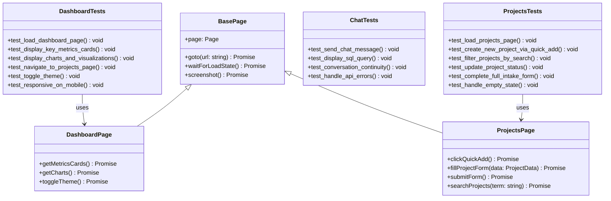

## Utility Classes

### Backend Utilities

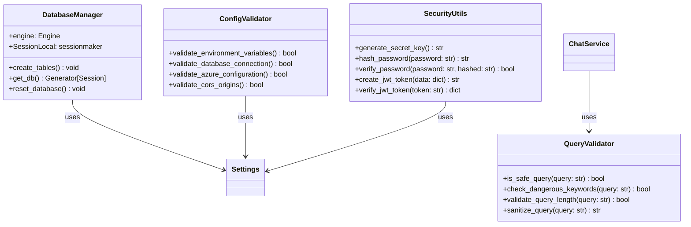

### Frontend Utilities

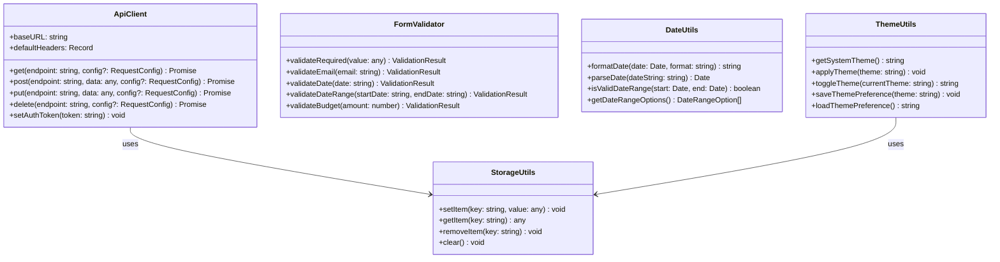

This comprehensive class diagram documentation provides a detailed view of the object-oriented structure of the Multi-Cloud Operations Dashboard, covering both backend and frontend components, their relationships, and key methods.