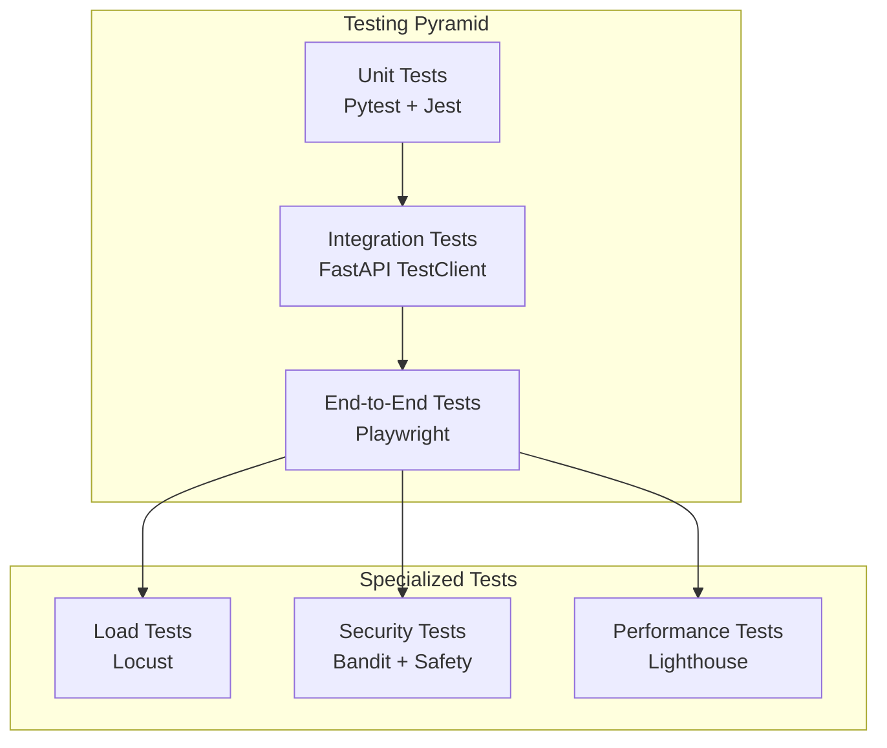

# Multi-Cloud Operations Dashboard - Testing Guide

## Overview

This document provides comprehensive guidance for testing the Multi-Cloud Operations Dashboard application. The testing strategy includes unit tests, integration tests, end-to-end tests, load tests, and security tests.

## Testing Architecture

### Testing Pyramid



### Test Categories

1. **Unit Tests** (70% of tests)
   - Individual function/method testing
   - Mock external dependencies
   - Fast execution (< 1s per test)

2. **Integration Tests** (20% of tests)
   - API endpoint testing
   - Database integration
   - Service interaction testing

3. **End-to-End Tests** (10% of tests)
   - Full user workflow testing
   - Browser automation
   - Cross-browser compatibility

4. **Load Tests**
   - Performance under load
   - Scalability testing
   - Resource utilization

5. **Security Tests**
   - Vulnerability scanning
   - Penetration testing
   - Dependency auditing

## Test Setup and Configuration

### Prerequisites

```bash
# Backend dependencies
pip install -r backend/requirements-test.txt

# Frontend dependencies
cd frontend
npm install @playwright/test @types/node typescript
npx playwright install
```

### Environment Configuration

Create test environment files:

```bash
# Backend test environment
export ENVIRONMENT=test
export DATABASE_URL=sqlite:///./test.db
export SECRET_KEY=test-secret-key-for-testing-only
export AZURE_CLIENT_ID=test-client-id
export AZURE_TENANT_ID=test-tenant-id

# Frontend test environment
export NEXT_PUBLIC_API_URL=http://localhost:8000
export NEXT_PUBLIC_AZURE_CLIENT_ID=test-client-id
export NEXT_PUBLIC_AZURE_TENANT_ID=test-tenant-id
```

## Running Tests

### Quick Start

```bash
# Run all tests
python run_tests.py --all

# Setup test environments
python run_tests.py --setup

# Run specific test types
python run_tests.py --unit
python run_tests.py --integration
python run_tests.py --frontend
python run_tests.py --load
python run_tests.py --security
```

### Backend Testing

#### Unit Tests

```bash
# Run all unit tests
cd backend
python -m pytest tests/unit/ -v

# Run specific test file
python -m pytest tests/unit/test_auth.py -v

# Run with coverage
python -m pytest tests/unit/ --cov=app --cov-report=html

# Run tests matching pattern
python -m pytest -k "test_auth" -v
```

#### Integration Tests

```bash
# Run all integration tests
python -m pytest tests/integration/ -v

# Run API tests
python -m pytest tests/integration/test_api_projects.py -v

# Run with database
python -m pytest tests/integration/ --tb=short
```

#### Test Markers

```bash
# Run tests by marker
python -m pytest -m unit          # Unit tests only
python -m pytest -m integration   # Integration tests only
python -m pytest -m api          # API tests only
python -m pytest -m security     # Security tests only
python -m pytest -m slow         # Slow tests only
```

### Frontend Testing

#### End-to-End Tests

```bash
# Run all E2E tests
cd frontend
npx playwright test

# Run in headed mode (visible browser)
npx playwright test --headed

# Run specific test file
npx playwright test tests/e2e/dashboard.spec.ts

# Run with UI mode
npx playwright test --ui

# Debug mode
npx playwright test --debug

# Generate test code
npx playwright codegen http://localhost:3001
```

#### Cross-Browser Testing

```bash
# Run on specific browser
npx playwright test --project=chromium
npx playwright test --project=firefox
npx playwright test --project=webkit

# Run on mobile
npx playwright test --project="Mobile Chrome"
npx playwright test --project="Mobile Safari"
```

### Load Testing

#### Basic Load Testing

```bash
# Run load tests
python run_tests.py --load

# Custom load test parameters
python run_tests.py --load --users 50 --spawn-rate 5 --duration 60s

# Interactive load testing
cd backend
locust -f tests/load/locustfile.py --host http://localhost:8000
```

#### Load Test Scenarios

1. **Normal Load**: 10 users, 2/s spawn rate, 30s duration
2. **Peak Load**: 50 users, 5/s spawn rate, 60s duration
3. **Stress Test**: 100 users, 10/s spawn rate, 120s duration
4. **Spike Test**: 200 users, 20/s spawn rate, 30s duration

### Security Testing

#### Automated Security Scans

```bash
# Run security tests
python run_tests.py --security

# Manual security scans
cd backend
bandit -r app/ -f json -o security_report.json
safety check --json --output dependency_report.json

# Frontend security audit
cd frontend
npm audit
npm audit fix
```

#### Security Test Categories

1. **Static Analysis**: Code vulnerability scanning
2. **Dependency Scanning**: Known vulnerability detection
3. **Input Validation**: SQL injection, XSS testing
4. **Authentication**: Auth bypass attempts
5. **Authorization**: Permission escalation tests

## Test Data Management

### Test Fixtures

Backend test fixtures are defined in `backend/tests/conftest.py`:

```python
# Database session fixture
@pytest.fixture
def db_session():
    # Creates fresh database for each test

# Sample data fixtures
@pytest.fixture
def sample_project():
    # Creates test project

@pytest.fixture
def sample_user():
    # Creates test user

@pytest.fixture
def auth_headers():
    # Provides authentication headers
```

### Test Data Seeding

```bash
# Seed comprehensive test data
cd backend
python seed_comprehensive_data.py

# Reset test database
python reset_database.py
```

### Mock Services

Mock external services for testing:

```python
# Mock Azure OpenAI
@pytest.fixture
def mock_azure_openai_client(mocker):
    mock_client = mocker.MagicMock()
    # Configure mock responses
    return mock_client

# Mock cloud services
@pytest.fixture
def mock_aws_service():
    return MockAWSService()
```

## Test Organization

### Backend Test Structure

```
backend/tests/
├── conftest.py              # Test configuration and fixtures
├── unit/                    # Unit tests
│   ├── test_auth.py        # Authentication tests
│   ├── test_chat_service.py # Chat service tests
│   ├── test_models.py      # Database model tests
│   └── test_schemas.py     # Pydantic schema tests
├── integration/             # Integration tests
│   ├── test_api_projects.py # Project API tests
│   ├── test_api_chat.py    # Chat API tests
│   └── test_database.py    # Database integration tests
└── load/                   # Load tests
    └── locustfile.py       # Locust load test scenarios
```

### Frontend Test Structure

```
frontend/tests/
├── global-setup.ts         # Global test setup
├── global-teardown.ts      # Global test cleanup
├── e2e/                    # End-to-end tests
│   ├── dashboard.spec.ts   # Dashboard page tests
│   ├── projects.spec.ts    # Projects page tests
│   └── auth.spec.ts        # Authentication tests
├── fixtures/               # Test fixtures and data
└── utils/                  # Test utilities
```

## Writing Tests

### Backend Test Examples

#### Unit Test Example

```python
import pytest
from app.services.chat_service import ChatService

class TestChatService:
    def test_extract_sql_query(self):
        """Test SQL query extraction."""
        service = ChatService()
        
        message = "Here's your query:\n\n```sql\nSELECT * FROM project;\n```"
        sql_query = service._extract_sql_query(message)
        
        assert sql_query == "SELECT * FROM project;"
    
    def test_execute_query_security(self):
        """Test SQL injection protection."""
        service = ChatService()
        mock_db = MagicMock()
        
        malicious_query = "SELECT * FROM project; DROP TABLE users;"
        
        with pytest.raises(Exception) as exc_info:
            service.execute_query(malicious_query, mock_db)
        
        assert "forbidden keyword" in str(exc_info.value)
```

#### Integration Test Example

```python
def test_create_project(client, auth_headers, sample_project_data):
    """Test project creation API."""
    response = client.post(
        "/api/projects/", 
        json=sample_project_data, 
        headers=auth_headers
    )
    
    assert response.status_code == 200
    data = response.json()
    assert data["project_name"] == sample_project_data["project_name"]
    assert "id" in data
```

### Frontend Test Examples

#### E2E Test Example

```typescript
import { test, expect } from '@playwright/test';

test('should create a new project', async ({ page }) => {
  await page.goto('/projects');
  
  // Click Quick Add button
  await page.click('text=Quick Add');
  
  // Fill form
  await page.fill('input[name="project_name"]', 'E2E Test Project');
  await page.selectOption('select[name="project_type"]', 'External');
  await page.fill('input[name="member_firm"]', 'Test Corp');
  
  // Submit form
  await page.click('button[type="submit"]');
  
  // Verify success
  await expect(page.locator('text=Project created successfully')).toBeVisible();
});
```

## Test Coverage

### Coverage Requirements

- **Minimum Coverage**: 80%
- **Critical Paths**: 95%
- **New Code**: 90%

### Coverage Reports

```bash
# Generate coverage report
cd backend
python -m pytest --cov=app --cov-report=html --cov-report=term

# View HTML report
open htmlcov/index.html

# Coverage by file
python -m pytest --cov=app --cov-report=term-missing
```

### Coverage Exclusions

```python
# .coveragerc
[run]
omit = 
    */tests/*
    */venv/*
    */migrations/*
    */conftest.py
    */settings/*

[report]
exclude_lines =
    pragma: no cover
    def __repr__
    raise AssertionError
    raise NotImplementedError
```

## Continuous Integration

### GitHub Actions Workflow

```yaml
name: Tests

on: [push, pull_request]

jobs:
  backend-tests:
    runs-on: ubuntu-latest
    steps:
      - uses: actions/checkout@v3
      - name: Set up Python
        uses: actions/setup-python@v4
        with:
          python-version: '3.11'
      - name: Install dependencies
        run: |
          cd backend
          pip install -r requirements-test.txt
      - name: Run tests
        run: |
          cd backend
          python -m pytest --cov=app --cov-report=xml
      - name: Upload coverage
        uses: codecov/codecov-action@v3

  frontend-tests:
    runs-on: ubuntu-latest
    steps:
      - uses: actions/checkout@v3
      - name: Set up Node.js
        uses: actions/setup-node@v3
        with:
          node-version: '18'
      - name: Install dependencies
        run: |
          cd frontend
          npm install
          npx playwright install
      - name: Run E2E tests
        run: |
          cd frontend
          npx playwright test
```

## Performance Testing

### Performance Metrics

1. **Response Time**: < 200ms for API calls
2. **Page Load**: < 3s for initial load
3. **Memory Usage**: < 512MB per user session
4. **CPU Usage**: < 70% under normal load

### Performance Test Tools

```bash
# Lighthouse performance audit
npx lighthouse http://localhost:3001 --output html --output-path lighthouse-report.html

# Load testing with Locust
locust -f tests/load/locustfile.py --host http://localhost:8000

# Memory profiling
python -m memory_profiler backend/app/main.py
```

## Test Debugging

### Backend Debugging

```bash
# Run tests with debugger
python -m pytest tests/unit/test_auth.py::test_verify_token --pdb

# Verbose output
python -m pytest -v -s tests/unit/

# Show local variables on failure
python -m pytest --tb=long tests/unit/

# Run specific test with print statements
python -m pytest -s tests/unit/test_auth.py::test_specific_function
```

### Frontend Debugging

```bash
# Debug mode (opens browser)
npx playwright test --debug

# Headed mode (visible browser)
npx playwright test --headed

# Slow motion
npx playwright test --headed --slowMo=1000

# Record test
npx playwright codegen http://localhost:3001
```

### Test Isolation

```python
# Ensure test isolation
@pytest.fixture(autouse=True)
def isolate_db(db_session):
    """Ensure each test gets clean database."""
    yield
    db_session.rollback()
    db_session.close()
```

## Best Practices

### Test Writing Guidelines

1. **AAA Pattern**: Arrange, Act, Assert
2. **Single Responsibility**: One assertion per test
3. **Descriptive Names**: Clear test purpose
4. **Independent Tests**: No test dependencies
5. **Fast Execution**: Keep tests quick

### Test Data Guidelines

1. **Minimal Data**: Use only necessary test data
2. **Realistic Data**: Use production-like data
3. **Clean State**: Reset between tests
4. **Factories**: Use factories for complex objects

### Mock Guidelines

1. **Mock External Services**: Don't test third-party code
2. **Verify Interactions**: Assert mock calls
3. **Realistic Mocks**: Match real service behavior
4. **Minimal Mocking**: Mock only what's necessary

## Troubleshooting

### Common Issues

#### Database Connection Issues
```bash
# Check database URL
echo $DATABASE_URL

# Reset test database
python backend/reset_database.py

# Check database permissions
sqlite3 backend/test.db ".tables"
```

#### Authentication Issues
```bash
# Check auth configuration
echo $AZURE_CLIENT_ID
echo $AZURE_TENANT_ID

# Verify mock auth is working
python -c "from backend.app.core.auth import get_current_user; print('Auth OK')"
```

#### Frontend Test Issues
```bash
# Check if servers are running
curl http://localhost:8000/health
curl http://localhost:3001

# Clear Playwright cache
npx playwright install --force

# Check browser installation
npx playwright install-deps
```

### Test Failure Analysis

1. **Read Error Messages**: Understand the failure
2. **Check Logs**: Review application logs
3. **Isolate Issue**: Run single test
4. **Debug Mode**: Use debugger
5. **Check Environment**: Verify configuration

## Reporting

### Test Reports

```bash
# Generate comprehensive report
python run_tests.py --report

# HTML test report
python -m pytest --html=report.html --self-contained-html

# JUnit XML report
python -m pytest --junitxml=junit.xml

# JSON report
python -m pytest --json-report --json-report-file=report.json
```

### Metrics Tracking

Track these metrics over time:
- Test count by category
- Test execution time
- Code coverage percentage
- Failure rate
- Performance metrics

## Maintenance

### Regular Tasks

1. **Update Dependencies**: Monthly dependency updates
2. **Review Coverage**: Weekly coverage analysis
3. **Performance Check**: Monthly performance testing
4. **Security Scan**: Weekly security scans
5. **Test Cleanup**: Quarterly test review

### Test Maintenance

1. **Remove Obsolete Tests**: Clean up unused tests
2. **Update Test Data**: Keep test data current
3. **Refactor Tests**: Improve test quality
4. **Documentation**: Keep test docs updated

This comprehensive testing guide ensures robust quality assurance for the Multi-Cloud Operations Dashboard application.