# Multi-Cloud Operations Dashboard - Architecture Documentation

## System Overview

The Multi-Cloud Operations Dashboard is a full-stack web application designed to manage multi-cloud operations, projects, costs, and resources. It follows a modern microservices-inspired architecture with clear separation of concerns.

## Architecture Diagrams

### High-Level System Architecture

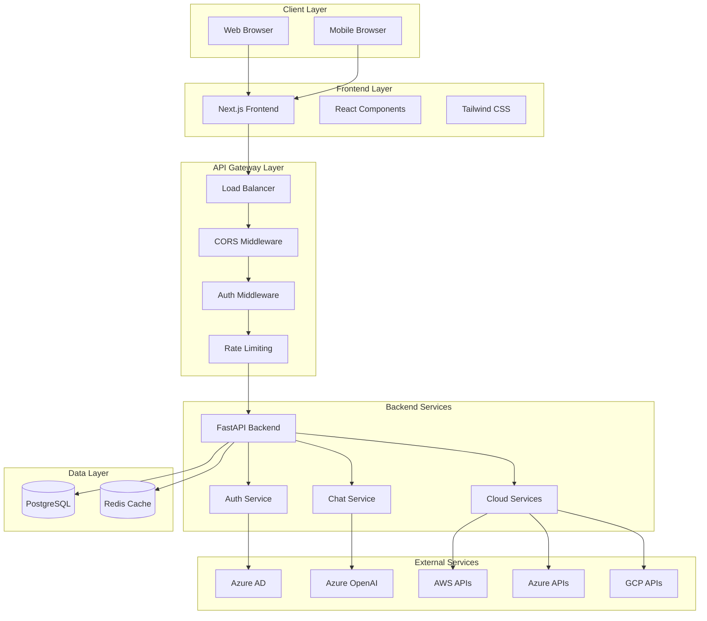

### Component Architecture

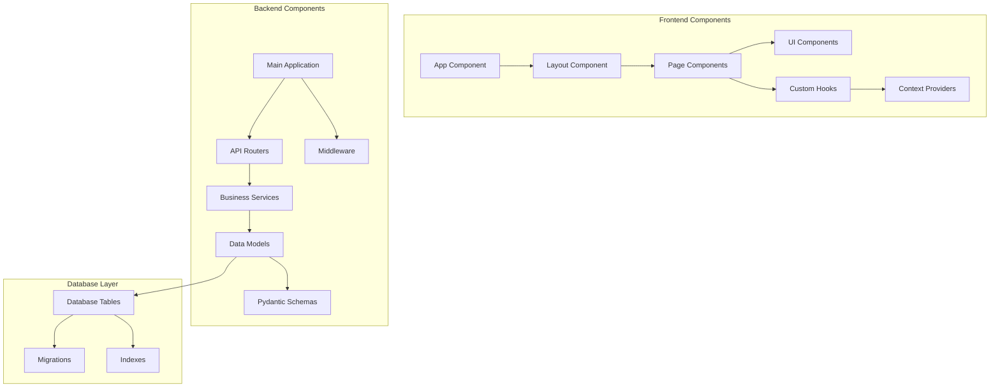

### Data Flow Architecture

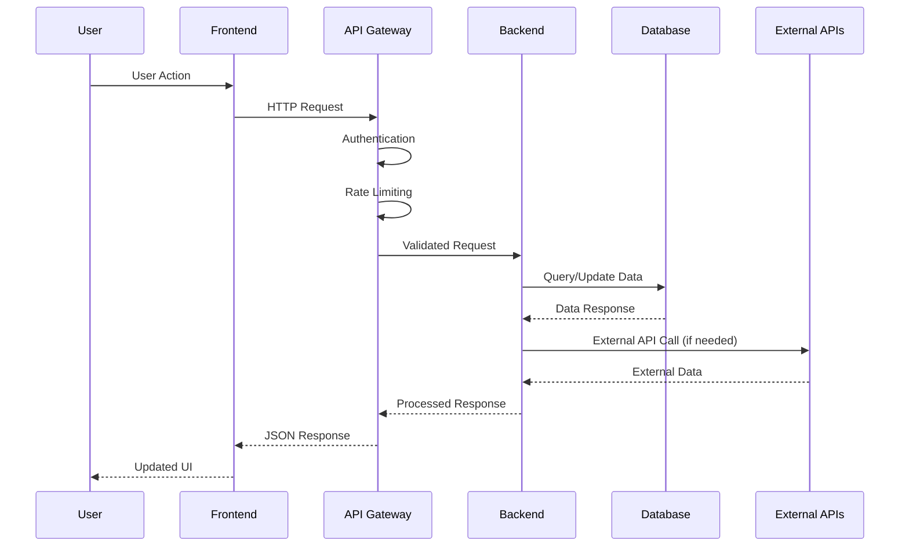

## Technology Stack

### Frontend Stack
- **Framework**: Next.js 15.0.0
- **UI Library**: React 18.2.0
- **Styling**: Tailwind CSS 3.3.6
- **State Management**: React Context + Hooks
- **Authentication**: Azure MSAL
- **Charts**: Recharts 2.10.3
- **Icons**: Lucide React 0.294.0
- **HTTP Client**: Fetch API
- **Build Tool**: Next.js built-in

### Backend Stack
- **Framework**: FastAPI 0.104.1
- **Language**: Python 3.11
- **Database ORM**: SQLAlchemy 2.0.23
- **Validation**: Pydantic 2.5.0
- **Authentication**: JWT + Azure AD
- **Database**: PostgreSQL 15
- **AI Integration**: Azure OpenAI
- **Cloud SDKs**: AWS SDK, Azure SDK, GCP SDK
- **Testing**: Pytest 7.4.3

### Infrastructure Stack
- **Containerization**: Docker + Docker Compose
- **Database**: PostgreSQL 15
- **Caching**: Redis (optional)
- **Cloud Deployment**: Azure Container Instances
- **Infrastructure as Code**: Terraform
- **CI/CD**: GitHub Actions
- **Monitoring**: Azure Monitor

## Security Architecture

### Authentication Flow

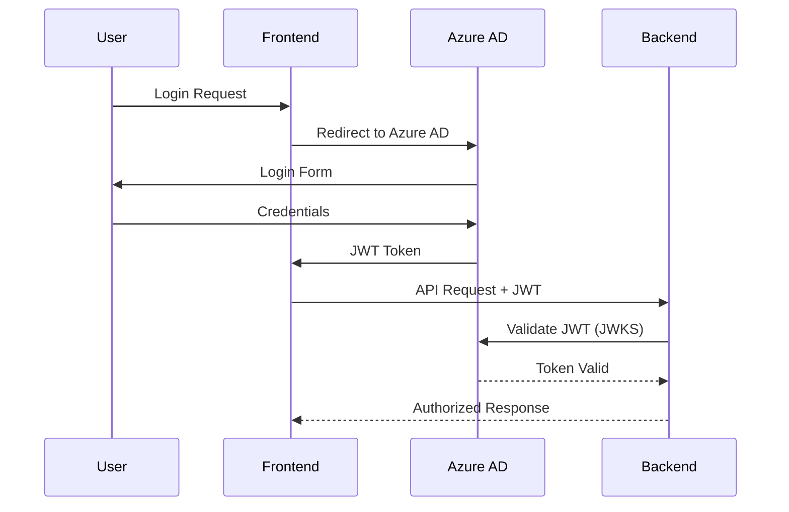

### Security Layers

```mermaid
graph TB
    subgraph "Security Layers"
        WAF[Web Application Firewall]
        TLS[TLS/HTTPS Encryption]
        CORS[CORS Protection]
        AUTH[Authentication Layer]
        AUTHZ[Authorization Layer]
        INPUT[Input Validation]
        SQL[SQL Injection Protection]
        XSS[XSS Protection]
        RATE[Rate Limiting]
        AUDIT[Audit Logging]
    end
    
    WAF --> TLS
    TLS --> CORS
    CORS --> AUTH
    AUTH --> AUTHZ
    AUTHZ --> INPUT
    INPUT --> SQL
    SQL --> XSS
    XSS --> RATE
    RATE --> AUDIT
```

## Database Architecture

### Entity Relationship Diagram

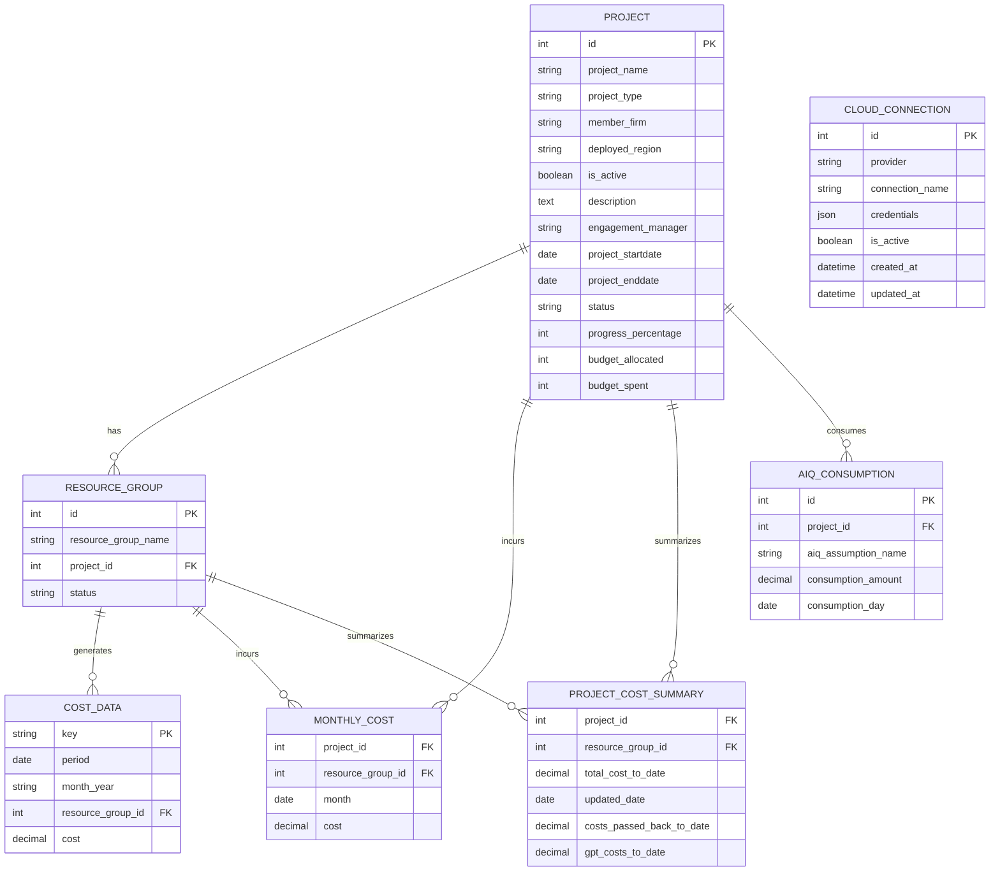

## API Architecture

### REST API Design

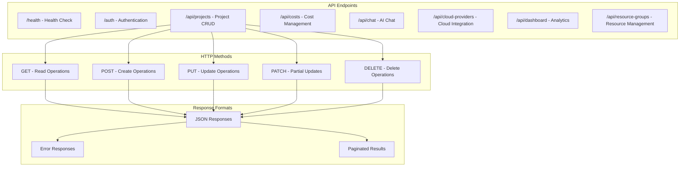

### Middleware Stack

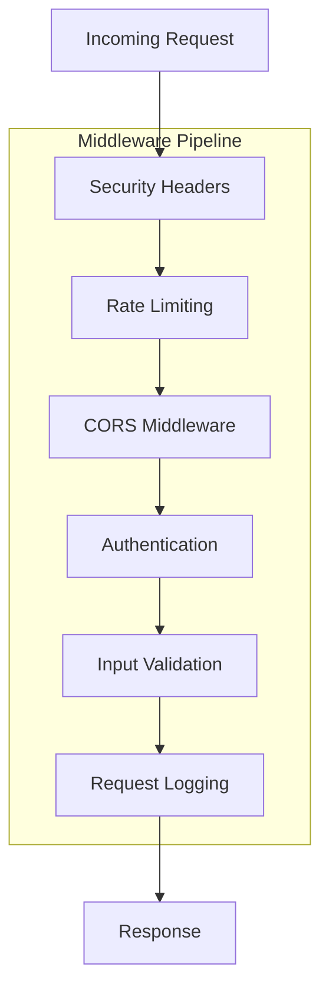

## Deployment Architecture

### Container Architecture

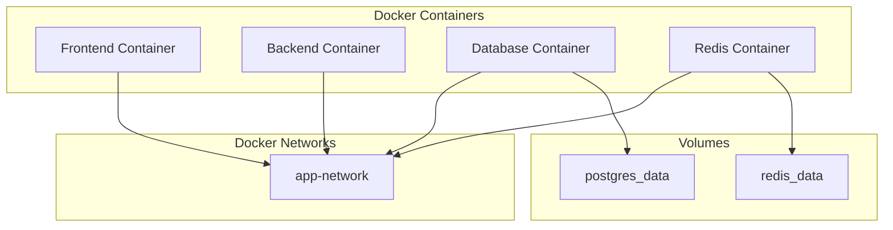

### Cloud Deployment

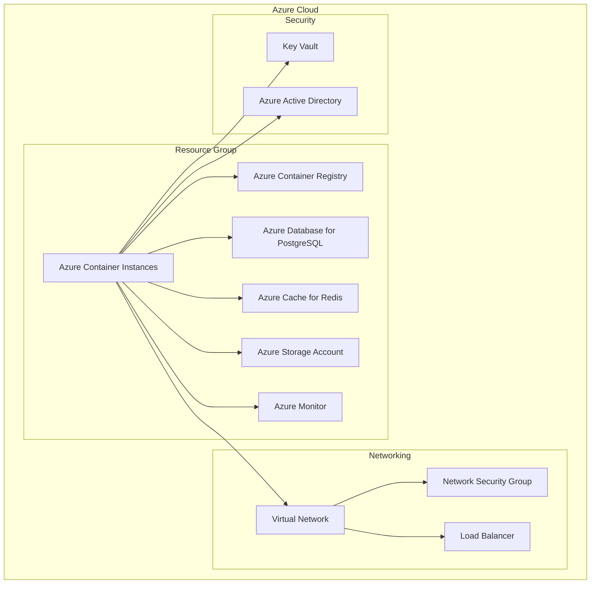

## Performance Architecture

### Caching Strategy

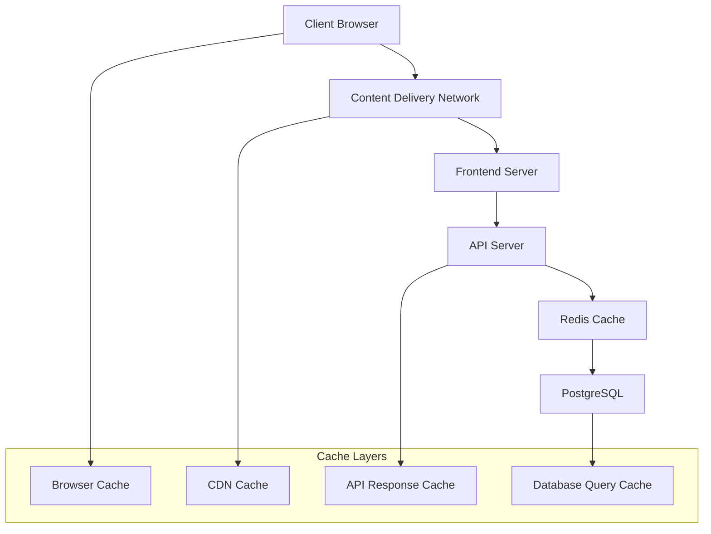

### Scalability Patterns

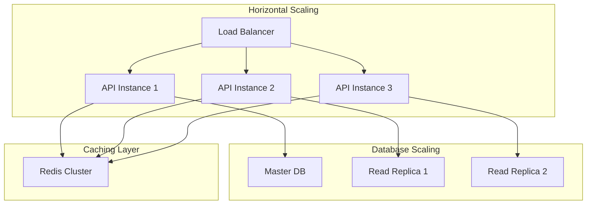

## Monitoring Architecture

### Observability Stack

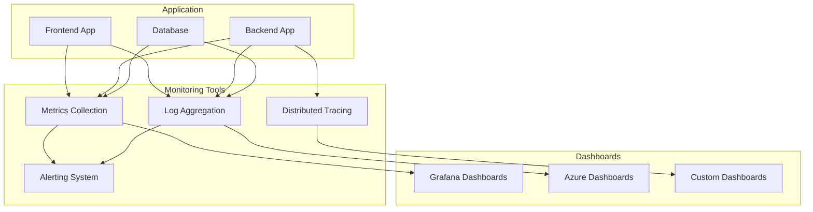

## Development Architecture

### Development Workflow

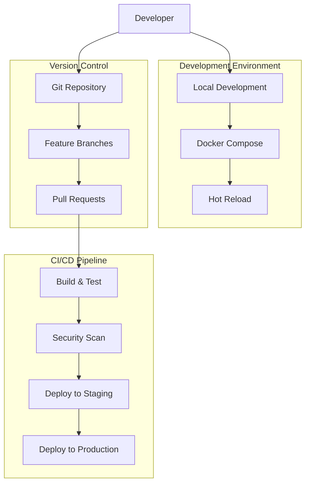

## Quality Assurance Architecture

### Testing Strategy

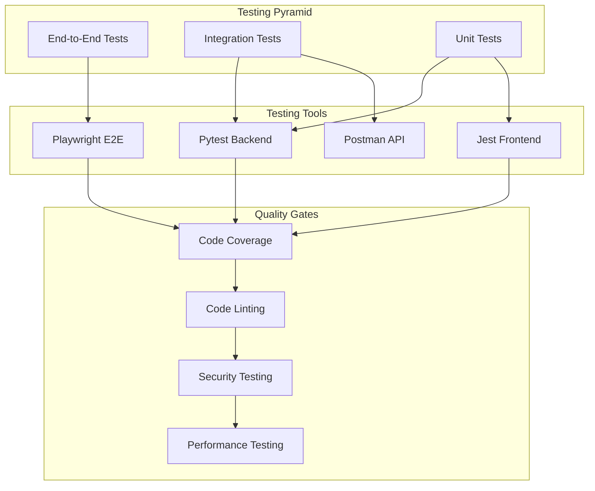

## Configuration Management

### Environment Configuration

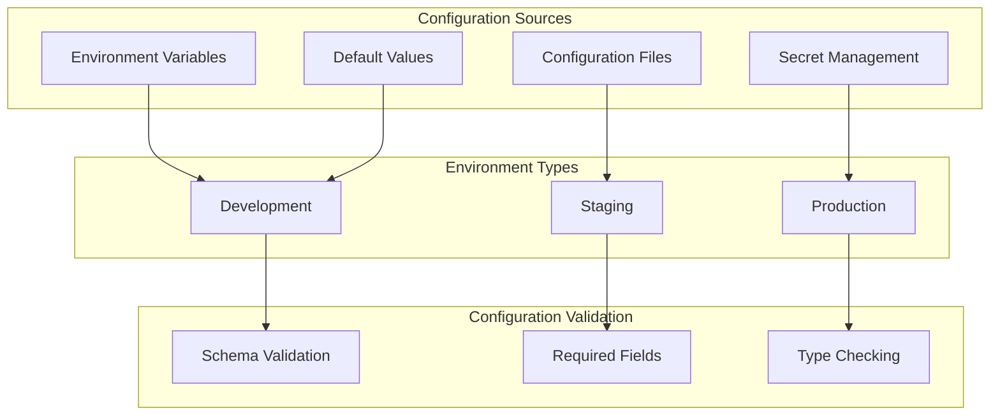

This architecture documentation provides a comprehensive overview of the Multi-Cloud Operations Dashboard system design, covering all major architectural aspects from high-level system design to detailed component interactions.